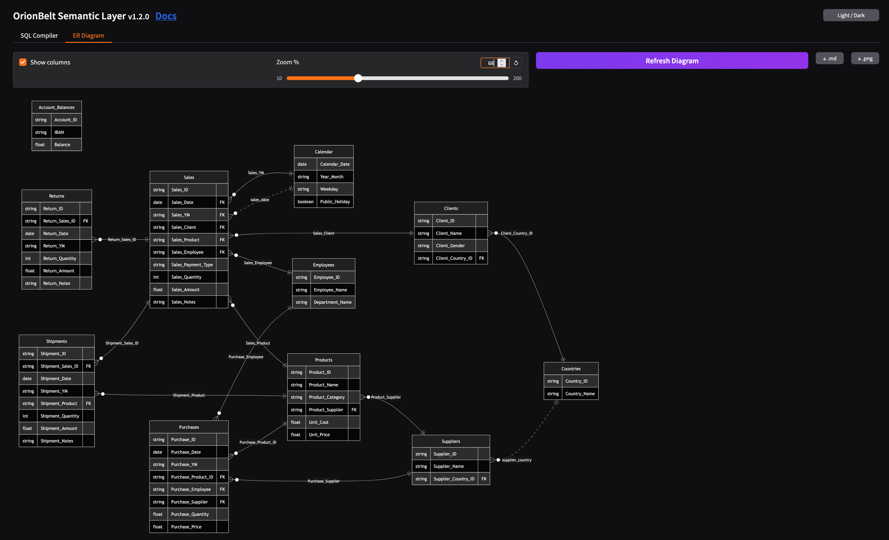
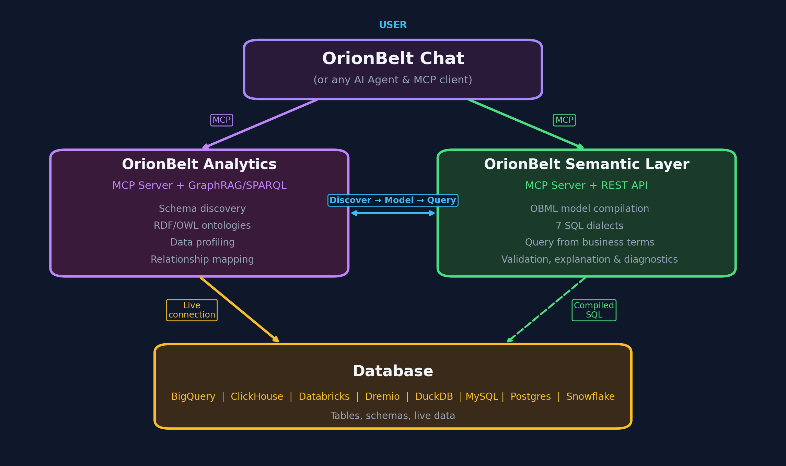

<p align="center">
  
</p>

<h1 align="center">OrionBelt Semantic Layer</h1>

<p align="center"><strong>Compile and execute YAML semantic models as analytical SQL across multiple database dialects</strong></p>

[](https://github.com/ralfbecher/orionbelt-semantic-layer/releases)
[](https://www.python.org/downloads/)
[](https://github.com/ralfbecher/orionbelt-semantic-layer/blob/main/LICENSE)
[](https://fastapi.tiangolo.com)
[](https://docs.pydantic.dev)
[](https://www.gradio.app)
[](https://github.com/tobymao/sqlglot)
[](https://arrow.apache.org/docs/format/FlightSql.html)
[](https://peps.python.org/pep-0249/)
[](https://docs.docker.com)
[](https://docs.astral.sh/ruff/)
[](https://mypy-lang.org)

[](https://cloud.google.com/bigquery)
[](https://www.postgresql.org)
[](https://www.snowflake.com)
[](https://clickhouse.com)
[](https://www.dremio.com)
[](https://www.databricks.com)
[](https://duckdb.org)

OrionBelt Semantic Layer is an **API-first** semantic engine and query planner for AI agents that compiles and executes declarative YAML model definitions as optimized SQL for BigQuery, ClickHouse, Databricks, Dremio, DuckDB/MotherDuck, Postgres, and Snowflake. It provides a unified abstraction over your data warehouse, so analysts and applications can query using business concepts (dimensions, measures, metrics) instead of raw SQL. Every capability — model loading, validation, query compilation and execution, and diagram generation — is exposed through a REST API, making OrionBelt easy to integrate into any application, workflow, or AI assistant.

## Features

- **7 SQL Dialects** — BigQuery, ClickHouse, Databricks, Dremio, DuckDB/MotherDuck, Postgres, Snowflake with dialect-specific optimizations
- **AST-Based SQL Generation** — Custom SQL AST ensures correct, injection-safe SQL (no string concatenation)
- **OrionBelt ML (OBML)** — YAML-based semantic models with data objects, dimensions, measures, metrics, and joins
- **Star Schema & CFL Planning** — Automatic join path resolution with Composite Fact Layer support for multi-fact queries and dimension-only queries through intermediate tables
- **Dimension Exclusion** — Anti-join queries via `dimensionsExclude` flag to find non-existing combinations (e.g., directors and producers who never collaborated)
- **Vendor-Specific SQL Validation** — Post-generation syntax validation via sqlglot for each target dialect (non-blocking)
- **Validation with Source Positions** — Precise error reporting with line/column numbers from YAML source, including join graph analysis (cycle and multipath detection, secondary join constraints)
- **Session Management** — TTL-scoped sessions with per-client model stores
- **ER Diagram Generation** — Mermaid ER diagrams via API and Gradio UI with theme support, zoom, and secondary join visualization
- **REST API** — FastAPI-powered session endpoints for model loading, validation, compilation, execution, diagram generation, and management
- **MCP Server** — Available as a separate thin client in [orionbelt-semantic-layer-mcp](https://github.com/ralfbecher/orionbelt-semantic-layer-mcp) — delegates to the REST API via HTTP, deployable independently (e.g. to Prefect Horizon)
- **Gradio UI** — Interactive web interface for model editing, query testing, and SQL compilation with live validation feedback
- **[OSI](https://github.com/open-semantic-interchange/OSI) Interoperability** — Bidirectional conversion between OBML and the Open Semantic Interchange format via REST API (`/convert`) and Gradio UI, with validation for both directions
- **DB-API 2.0 Drivers** — PEP 249 drivers for all 7 databases with transparent OBML-to-SQL compilation via REST API
- **Arrow Flight SQL** — Embedded gRPC server for DBeaver, Tableau, and Power BI — single container, two ports (8080 + 8815)
- **Plugin Architecture** — Extensible dialect system with capability flags and registry

## Quick Start

### Prerequisites

- Python 3.12+
- [uv](https://docs.astral.sh/uv/) package manager

### Installation

```bash
git clone https://github.com/ralfbecher/orionbelt-semantic-layer.git
cd orionbelt-semantic-layer
uv sync
```

### Run Tests

```bash
uv run pytest
```

### Start the REST API Server

```bash
uv run orionbelt-api
# or with reload:
uv run uvicorn orionbelt.api.app:create_app --factory --reload
```

The API is available at `http://127.0.0.1:8000`. Interactive docs at `/docs` (Swagger UI) and `/redoc`.

## Example

### Define a Semantic Model

```yaml
# yaml-language-server: $schema=schema/obml-schema.json
version: 1.0

dataObjects:
  Customers:
    code: CUSTOMERS
    database: WAREHOUSE
    schema: PUBLIC
    synonyms: [client, buyer, purchaser]
    columns:
      Customer ID:
        code: CUSTOMER_ID
        abstractType: string
      Country:
        code: COUNTRY
        abstractType: string

  Orders:
    code: ORDERS
    database: WAREHOUSE
    schema: PUBLIC
    columns:
      Order ID:
        code: ORDER_ID
        abstractType: string
      Order Customer ID:
        code: CUSTOMER_ID
        abstractType: string
      Price:
        code: PRICE
        abstractType: float
        numClass: non-additive
      Quantity:
        code: QUANTITY
        abstractType: int
        numClass: additive
    joins:
      - joinType: many-to-one
        joinTo: Customers
        columnsFrom:
          - Order Customer ID
        columnsTo:
          - Customer ID

dimensions:
  Country:
    dataObject: Customers
    column: Country
    resultType: string

measures:
  Revenue:
    resultType: float
    aggregation: sum
    expression: "{[Orders].[Price]} * {[Orders].[Quantity]}"
    synonyms: [sales, income, turnover]
```

The `yaml-language-server` comment enables schema validation in editors that support it (VS Code with YAML extension, IntelliJ, etc.). The JSON Schema is at [`schema/obml-schema.json`](schema/obml-schema.json).

### Define a Query

Queries select dimensions and measures by their business names:

```yaml
select:
  dimensions:
    - Country
  measures:
    - Revenue
limit: 100
```

### Compile to SQL (Python)

```python
from orionbelt.compiler.pipeline import CompilationPipeline
from orionbelt.models.query import QueryObject, QuerySelect
from orionbelt.parser.loader import TrackedLoader
from orionbelt.parser.resolver import ReferenceResolver

# Load and parse the model
loader = TrackedLoader()
raw, source_map = loader.load("model.yaml")
model, result = ReferenceResolver().resolve(raw, source_map)

# Define a query
query = QueryObject(
    select=QuerySelect(
        dimensions=["Country"],
        measures=["Revenue"],
    ),
    limit=100,
)

# Compile to SQL
pipeline = CompilationPipeline()
result = pipeline.compile(query, model, "postgres")
print(result.sql)
```

**Generated SQL (Postgres):**

```sql
SELECT
  "Customers"."COUNTRY" AS "Country",
  SUM("Orders"."PRICE" * "Orders"."QUANTITY") AS "Revenue"
FROM WAREHOUSE.PUBLIC.ORDERS AS "Orders"
LEFT JOIN WAREHOUSE.PUBLIC.CUSTOMERS AS "Customers"
  ON "Orders"."CUSTOMER_ID" = "Customers"."CUSTOMER_ID"
GROUP BY "Customers"."COUNTRY"
LIMIT 100
```

Change the dialect to `"bigquery"`, `"clickhouse"`, `"databricks"`, `"dremio"`, `"duckdb"`, or `"snowflake"` to get dialect-specific SQL.

### Use the REST API with Sessions

```bash
# Start the server
uv run orionbelt-api

# Create a session
curl -s -X POST http://127.0.0.1:8000/v1/sessions | jq
# → {"session_id": "a1b2c3d4e5f6", "model_count": 0, ...}

# Load a model into the session
curl -s -X POST http://127.0.0.1:8000/v1/sessions/a1b2c3d4e5f6/models \
  -H "Content-Type: application/json" \
  -d '{"model_yaml": "version: 1.0\ndataObjects:\n  ..."}' | jq
# → {"model_id": "abcd1234", "data_objects": 2, ...}

# Compile a query
curl -s -X POST http://127.0.0.1:8000/v1/sessions/a1b2c3d4e5f6/query/sql \
  -H "Content-Type: application/json" \
  -d '{
    "model_id": "abcd1234",
    "query": {"select": {"dimensions": ["Country"], "measures": ["Revenue"]}},
    "dialect": "postgres"
  }' | jq .sql
```

## Architecture

```
YAML Model          Query Object
    |                    |
    v                    v
 ┌───────────┐    ┌──────────────┐
 │  Parser   │    │  Resolution  │  ← Phase 1: resolve refs, select fact table,
 │  (ruamel) │    │              │    find join paths, classify filters
 └────┬──────┘    └──────┬───────┘
      │                  │
      v                  v
 SemanticModel    ResolvedQuery
      │                  │
      │    ┌─────────────┘
      │    │
      v    v
 ┌───────────────┐
 │   Planner     │  ← Phase 2: Star Schema or CFL (multi-fact)
 │  (star / cfl) │    builds SQL AST with joins, grouping, CTEs
 └───────┬───────┘
         │
         v
    SQL AST (Select, Join, Expr...)
         │
         v
 ┌───────────────┐
 │   Codegen     │  ← Phase 3: dialect renders AST to SQL string
 │  (dialect)    │    handles quoting, time grains, functions
 └───────┬───────┘
         │
         v
    SQL String (dialect-specific)
```

## Gradio UI

OrionBelt includes an interactive web UI built with [Gradio](https://www.gradio.app/) for exploring and testing the compilation pipeline visually.

### Local Development

For local development, the Gradio UI is automatically mounted at `/ui` on the REST API server when the `ui` extra is installed:

```bash
uv sync --extra ui
uv run orionbelt-api
# → API at http://localhost:8000
# → UI  at http://localhost:8000/ui
```

### Standalone Mode

The UI can also run as a separate process, connecting to the API via `API_BASE_URL`:

```bash
uv sync --extra ui

# Start the REST API (required backend)
uv run orionbelt-api &

# Launch the Gradio UI (standalone on port 7860)
API_BASE_URL=http://localhost:8000 uv run orionbelt-ui
```

### API and UI Live Demo Hosting at Google Cloud Run

OrionBelt Semantic Layer API and UI is available as a hosted live demo:

> **[http://35.187.174.102/ui](http://35.187.174.102/ui/?__theme=dark)**

API endpoint: `http://35.187.174.102` — Interactive docs: [Swagger UI](http://35.187.174.102/docs) | [ReDoc](http://35.187.174.102/redoc)

The API and UI services share a single IP via a Google Cloud Application Load Balancer with path-based routing. Cloud Armor provides WAF protection.

The API and UI are deployed as **separate Cloud Run services** behind a shared load balancer. The API image (`Dockerfile`) excludes Gradio for faster cold starts (~2-3s vs ~12s), while the UI image (`Dockerfile.ui`) connects to the API via `API_BASE_URL`:

```
Load Balancer (single IP)
  ├── /ui/*     → orionbelt-ui   (Gradio)
  └── /*        → orionbelt-api  (FastAPI)
```

<p align="center">
  
</p>

The UI provides:

- **Side-by-side editors** — OBML model (YAML) and query (YAML) with syntax highlighting
- **Dialect selector** — Switch between BigQuery, ClickHouse, Databricks, Dremio, DuckDB, Postgres, and Snowflake
- **One-click compilation** — Compile button generates formatted SQL output
- **SQL validation feedback** — Warnings and validation errors from sqlglot are displayed as comments above the generated SQL
- **ER Diagram tab** — Visualize the semantic model as a Mermaid ER diagram with left-to-right layout, FK annotations, dotted lines for secondary joins, and an adjustable zoom slider
- **OSI Import / Export** — Import OSI format models (converted to OBML) and export OBML models to OSI format, with validation feedback
- **Dark / light mode** — Toggle via the header button; all inputs and UI state are persisted across mode switches

The bundled example model (`examples/sem-layer.obml.yml`) is loaded automatically on startup.

<p align="center">
  
</p>

The ER diagram is also available as download (MD, or PNG) or via the REST API.

## Docker

### Build and Run

Two separate images — API-only (fast) and UI (with Gradio):

```bash
# API image (no Gradio, fast cold starts)
docker build -t orionbelt-api .
docker run -p 8080:8080 orionbelt-api

# UI image (Gradio, connects to API)
docker build -f Dockerfile.ui -t orionbelt-ui .
docker run -p 7860:7860 \
  -e API_BASE_URL=http://host.docker.internal:8080 \
  orionbelt-ui
```

The API is available at `http://localhost:8080`. The UI is at `http://localhost:7860`. Sessions are ephemeral (in-memory, lost on container restart).

### Run Integration Tests

```bash
# Build image and run 15 endpoint tests
./tests/docker/test_docker.sh

# Skip build (use existing image)
./tests/docker/test_docker.sh --no-build

# Run 30 tests against a live Cloud Run deployment
./tests/cloudrun/test_cloudrun.sh https://orionbelt-semantic-layer-mw2bqg2mva-ew.a.run.app
```

## DB-API 2.0 Drivers & Arrow Flight SQL

OrionBelt provides **PEP 249 DB-API 2.0 drivers** for 7 databases and an **Arrow Flight SQL server** that enables BI tools like DBeaver, Tableau, and Power BI to run OBML queries directly.

| Package | Database | Native Connector | Arrow Support |
|---------|----------|------------------|---------------|
| `ob-driver-core` | — (shared foundation) | — | — |
| `ob-bigquery` | BigQuery | `google-cloud-bigquery` | `to_arrow()` |
| `ob-duckdb` | DuckDB | `duckdb` | `fetch_arrow_table()` |
| `ob-postgres` | PostgreSQL | `adbc-driver-postgresql` | ADBC native |
| `ob-snowflake` | Snowflake | `snowflake-connector-python` | `fetch_arrow_all()` |
| `ob-clickhouse` | ClickHouse | `clickhouse-connect` | `query_arrow()` |
| `ob-dremio` | Dremio | `pyarrow.flight` | Flight native |
| `ob-databricks` | Databricks | `databricks-sql-connector` | `fetchall_arrow()` |
| `ob-flight-extension` | Arrow Flight SQL server | `pyarrow.flight` | — |

All drivers work against the OrionBelt REST API in **single-model mode** (`MODEL_FILE` set). OBML queries are compiled transparently via `POST /v1/query/sql` — the user writes OBML, the driver returns SQL results. Plain SQL queries bypass the API entirely.

```python
import ob_duckdb

conn = ob_duckdb.connect(database=":memory:")
with conn.cursor() as cur:
    # OBML query — compiled via API, executed on DuckDB
    cur.execute("select:\n  dimensions:\n    - Region\n  measures:\n    - Revenue\n")
    print(cur.fetchall())
```

The **Arrow Flight SQL server** (`ob-flight-extension`) runs inside the API process as a daemon thread, enabling JDBC/ODBC BI tools to connect directly. It is designed for on-premise or hybrid deployments — Cloud Run uses the standard API-only image.

```bash
# On-premise with Flight SQL enabled
docker build -f Dockerfile.flight -t orionbelt-flight .
docker run -p 8080:8080 -p 8815:8815 \
  -v /path/to/models/:/app/models/ \
  --env-file .env \
  orionbelt-flight
```

See **[Drivers Documentation](docs/drivers.md)** for full usage examples, connect() parameters, Flight SQL configuration, Docker Compose setup, and DBeaver/Tableau instructions.

## Configuration

Configuration is via environment variables or a `.env` file. See `.env.template` for all options:

| Variable                   | Default     | Description                             |
| -------------------------- | ----------- | --------------------------------------- |
| `LOG_LEVEL`                | `INFO`      | Logging level                           |
| `LOG_FORMAT`               | `console`   | `console` (pretty) or `json` (structured) |
| `API_SERVER_HOST`          | `localhost` | REST API bind host                      |
| `API_SERVER_PORT`          | `8000`      | REST API bind port                      |
| `PORT`                     | —           | Override port (Cloud Run sets this)     |
| `DISABLE_SESSION_LIST`     | `false`     | Disable `GET /sessions` endpoint        |
| `SESSION_TTL_SECONDS`      | `1800`      | Session inactivity timeout (30 min)     |
| `SESSION_CLEANUP_INTERVAL` | `60`        | Cleanup sweep interval (seconds)        |
| `MODEL_FILE`               | —           | Path to OBML YAML for single-model mode |
| `API_BASE_URL`             | —           | API URL for standalone UI               |
| `ROOT_PATH`                | —           | ASGI root path for UI behind LB         |
| `FLIGHT_ENABLED`           | `false`     | Enable Flight SQL + query execution     |
| `FLIGHT_PORT`              | `8815`      | Arrow Flight SQL gRPC port              |
| `FLIGHT_AUTH_MODE`         | `none`      | `none` or `token`                       |
| `FLIGHT_API_TOKEN`         | —           | Static token (when auth mode = token)   |
| `DB_VENDOR`                | `duckdb`    | Database vendor for query execution     |

### Single-Model Mode

When `MODEL_FILE` is set to a path to an OBML YAML file, the server starts in **single-model mode**:

- The model file is validated at startup (the server refuses to start if it's invalid)
- Every new session is automatically pre-loaded with the configured model
- Model upload (`POST /v1/sessions/{id}/models`) and removal (`DELETE /v1/sessions/{id}/models/{id}`) return **403 Forbidden**
- All other endpoints (sessions, query, validate, diagram, etc.) work normally

```bash
# Start in single-model mode
MODEL_FILE=./examples/sem-layer.obml.yml uv run orionbelt-api
```

## Development

```bash
# Install all dependencies (including dev tools)
uv sync

# Run the test suite
uv run pytest

# Lint
uv run ruff check src/

# Type check
uv run mypy src/

# Format code
uv run ruff format src/ tests/

# Build documentation
uv sync --extra docs
uv run mkdocs serve
```

## Documentation

Full documentation is available at the [docs site](https://ralfbecher.github.io/orionbelt-semantic-layer/) or can be built locally:

```bash
uv sync --extra docs
uv run mkdocs serve   # http://127.0.0.1:8080
```

## OSI Interoperability

OrionBelt includes a bidirectional converter between OBML and the [Open Semantic Interchange (OSI)](https://github.com/open-semantic-interchange/OSI) format. The converter handles the structural differences between the two formats — including metric decomposition, relationship restructuring, and lossless `ai_context` preservation via `customExtensions` — with built-in validation for both directions.

The conversion is available via REST API endpoints:

```bash
# Convert OSI → OBML
curl -X POST http://127.0.0.1:8000/v1/convert/osi-to-obml \
  -H "Content-Type: application/json" \
  -d '{"input_yaml": "version: \"0.1.1\"\nsemantic_model:\n  ..."}' | jq

# Convert OBML → OSI
curl -X POST http://127.0.0.1:8000/v1/convert/obml-to-osi \
  -H "Content-Type: application/json" \
  -d '{"input_yaml": "version: 1.0\ndataObjects:\n  ..."}' | jq
```

The Gradio UI also provides **Import OSI** / **Export to OSI** buttons that use these API endpoints.

See the [OSI ↔ OBML Mapping Analysis](osi-obml/osi_obml_mapping_analysis.md) for a detailed comparison and conversion reference.

## Companion Project

### [OrionBelt Analytics](https://github.com/ralfbecher/orionbelt-analytics)

OrionBelt Analytics is an ontology-based MCP server that analyzes relational database schemas and generates RDF/OWL ontologies with embedded SQL mappings. It connects to PostgreSQL, Snowflake, and Dremio, providing AI assistants with deep structural and semantic understanding of your data.

<p align="center">
  
</p>

Together, the two projects form a powerful combination for AI-guided analytical workflows:

- **OrionBelt Analytics** gives the AI contextual knowledge of your database schema, relationships, and business semantics
- **OrionBelt Semantic Layer** ensures correct, optimized SQL compilation and execution from business concepts (dimensions, measures, metrics)

By combining both, an AI assistant can navigate your data landscape through ontologies and compile safe, dialect-aware analytical SQL — enabling a seamless end-to-end analytical journey.

## License

Copyright 2025 [RALFORION d.o.o.](https://ralforion.com)

Licensed under the [Business Source License 1.1](LICENSE). The Licensed Work will convert to Apache License 2.0 on 2030-03-16.

By contributing to this project, you agree to the [Contributor License Agreement](CLA.md).

---

<p align="center">
  <a href="https://ralforion.com">
    
  </a>
</p>
