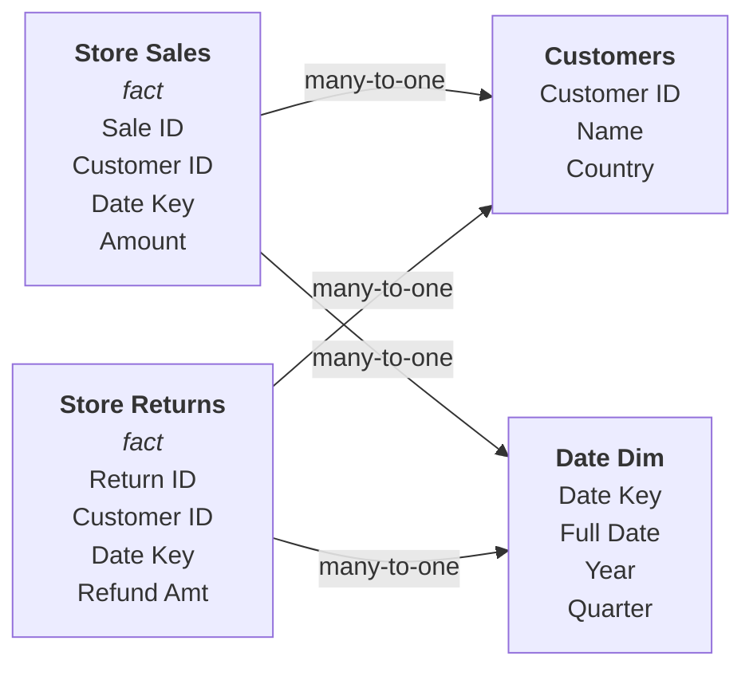
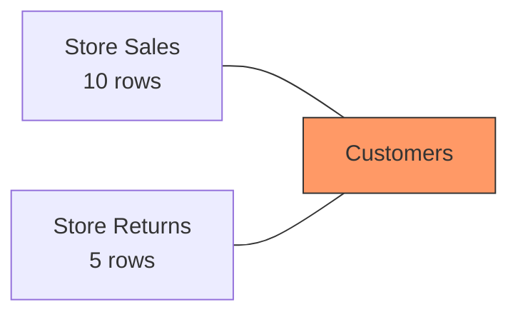

# Multi-Fact: Sales & Returns

This example demonstrates the **Composite Fact Layer (CFL)** planner with a multi-fact scenario. When a query combines measures from different fact tables, OrionBelt uses a CTE with `UNION ALL` to stitch the fact sets together (with NULL padding), then aggregates in the outer query.

## Scenario

An e-commerce company tracks **store sales** and **store returns** as separate fact tables, both sharing conformed dimensions: `Customers` and `Date Dim`.



Both fact tables join to the same dimension tables — these are **conformed dimensions**.

## The Model

```yaml
# yaml-language-server: $schema=schema/obml-schema.json
version: 1.0

dataObjects:
  Customers:
    code: CUSTOMERS
    database: WAREHOUSE
    schema: PUBLIC
    columns:
      Customer ID:
        code: CUSTOMER_ID
        abstractType: string
      Customer Name:
        code: NAME
        abstractType: string
      Country:
        code: COUNTRY
        abstractType: string

  Date Dim:
    code: DATE_DIM
    database: WAREHOUSE
    schema: PUBLIC
    columns:
      Date Key:
        code: DATE_KEY
        abstractType: int
      Full Date:
        code: FULL_DATE
        abstractType: date
      Year:
        code: YEAR_NUM
        abstractType: int
      Quarter:
        code: QUARTER_NUM
        abstractType: int

  Store Sales:
    code: STORE_SALES
    database: WAREHOUSE
    schema: PUBLIC
    columns:
      Sale ID:
        code: SALE_ID
        abstractType: string
      Customer ID:
        code: CUSTOMER_ID
        abstractType: string
      Date Key:
        code: DATE_KEY
        abstractType: int
      Amount:
        code: AMOUNT
        abstractType: float
    joins:
      - joinType: many-to-one
        joinTo: Customers
        columnsFrom:
          - Customer ID
        columnsTo:
          - Customer ID
      - joinType: many-to-one
        joinTo: Date Dim
        columnsFrom:
          - Date Key
        columnsTo:
          - Date Key

  Store Returns:
    code: STORE_RETURNS
    database: WAREHOUSE
    schema: PUBLIC
    columns:
      Return ID:
        code: RETURN_ID
        abstractType: string
      Customer ID:
        code: CUSTOMER_ID
        abstractType: string
      Date Key:
        code: DATE_KEY
        abstractType: int
      Refund Amount:
        code: REFUND_AMT
        abstractType: float
    joins:
      - joinType: many-to-one
        joinTo: Customers
        columnsFrom:
          - Customer ID
        columnsTo:
          - Customer ID
      - joinType: many-to-one
        joinTo: Date Dim
        columnsFrom:
          - Date Key
        columnsTo:
          - Date Key

dimensions:
  Customer Country:
    dataObject: Customers
    column: Country
    resultType: string

  Year:
    dataObject: Date Dim
    column: Year
    resultType: int

measures:
  Total Revenue:
    columns:
      - dataObject: Store Sales
        column: Amount
    resultType: float
    aggregation: sum

  Total Returns:
    columns:
      - dataObject: Store Returns
        column: Refund Amount
    resultType: float
    aggregation: sum

metrics:
  Net Revenue:
    expression: '{[Total Revenue]} - {[Total Returns]}'
```

## Query 1: Single-Fact (Star Schema)

When a query only uses measures from one fact table, OrionBelt uses the standard **star schema** planner — no CTEs needed.

```python
query = QueryObject(
    select=QuerySelect(
        dimensions=["Customer Country"],
        measures=["Total Revenue"],
    ),
    order_by=[QueryOrderBy(field="Total Revenue", direction=SortDirection.DESC)],
    limit=100,
)
```

**Generated SQL (Postgres):**

```sql
SELECT
  "Customers"."COUNTRY" AS "Customer Country",
  SUM("Store Sales"."AMOUNT") AS "Total Revenue"
FROM WAREHOUSE.PUBLIC.STORE_SALES AS "Store Sales"
LEFT JOIN WAREHOUSE.PUBLIC.CUSTOMERS AS "Customers"
  ON "Store Sales"."CUSTOMER_ID" = "Customers"."CUSTOMER_ID"
GROUP BY "Customers"."COUNTRY"
ORDER BY "Total Revenue" DESC
LIMIT 100
```

This is a straightforward star schema query: one fact table (`Store Sales`) joined to one dimension table (`Customers`).

## Query 2: Multi-Fact (CFL with UNION ALL)

When measures come from **different** fact tables, OrionBelt detects this and switches to the CFL planner. It stitches the facts together with `UNION ALL` inside a CTE, then aggregates in the outer query.

```python
query = QueryObject(
    select=QuerySelect(
        dimensions=["Customer Country"],
        measures=["Total Revenue", "Total Returns"],
    ),
    order_by=[QueryOrderBy(field="Total Revenue", direction=SortDirection.DESC)],
    limit=100,
)
```

**Generated SQL (Postgres):**

```sql
WITH composite_01 AS (
  SELECT
    "Customers"."COUNTRY" AS "Customer Country",
    "Store Sales"."AMOUNT" AS "Total Revenue",
    NULL AS "Total Returns"
  FROM WAREHOUSE.PUBLIC.STORE_SALES AS "Store Sales"
  LEFT JOIN WAREHOUSE.PUBLIC.CUSTOMERS AS "Customers"
    ON "Store Sales"."CUSTOMER_ID" = "Customers"."CUSTOMER_ID"

  UNION ALL

  SELECT
    "Customers"."COUNTRY" AS "Customer Country",
    NULL AS "Total Revenue",
    "Store Returns"."REFUND_AMT" AS "Total Returns"
  FROM WAREHOUSE.PUBLIC.STORE_RETURNS AS "Store Returns"
  LEFT JOIN WAREHOUSE.PUBLIC.CUSTOMERS AS "Customers"
    ON "Store Returns"."CUSTOMER_ID" = "Customers"."CUSTOMER_ID"
)
SELECT
  "Customer Country",
  SUM("Total Revenue") AS "Total Revenue",
  SUM("Total Returns") AS "Total Returns"
FROM composite_01
GROUP BY "Customer Country"
ORDER BY "Total Revenue" DESC
LIMIT 100
```

### What Happened

1. **Measure grouping** — The resolver detected that `Total Revenue` comes from `Store Sales` and `Total Returns` comes from `Store Returns` — two different fact tables
2. **UNION ALL with NULL padding** — Each fact leg selects the conformed dimensions plus its own measure columns, filling the other fact's measures with `NULL`. This produces a single row set at the raw grain
3. **Outer aggregation** — The outer query groups by the conformed dimensions and applies `SUM` over the unioned rows. Because each row only has a value for one fact's measures (NULLs are ignored by `SUM`), the results are correct
4. **No fanout** — The facts are never joined directly to each other, so no many-to-many explosion occurs

!!! info "Snowflake: UNION BY NAME"
    On Snowflake, OrionBelt uses `UNION BY NAME` instead of `UNION ALL`. This matches columns by name rather than position, so the NULL padding columns can be omitted — each fact leg only selects its own measures.

## Why CFL is Necessary

Without the Composite Fact Layer, combining measures from different fact tables in a single query would cause **fanout** — a many-to-many join that inflates aggregation results:



> Direct join: 10 x 5 = 50 rows — wrong SUM results!

By stacking the facts with `UNION ALL` and aggregating outside, CFL eliminates fanout entirely. Each row in the union contributes to exactly one fact's measures.

!!! tip "When CFL Activates"
    The compiler automatically selects CFL when `requires_cfl = True` in the resolved query. This happens when the query's measures reference fields from multiple distinct fact tables. You do not need to opt in — OrionBelt detects it for you.

## Query 3: Net Revenue Metric

Metrics that combine measures from different fact tables also use CFL:

```python
query = QueryObject(
    select=QuerySelect(
        dimensions=["Customer Country", "Year"],
        measures=["Net Revenue"],
    ),
)
```

**Generated SQL (Postgres):**

```sql
WITH composite_01 AS (
  SELECT
    "Customers"."COUNTRY" AS "Customer Country",
    "Date Dim"."YEAR_NUM" AS "Year",
    "Store Sales"."AMOUNT" AS "Total Revenue",
    NULL AS "Total Returns"
  FROM WAREHOUSE.PUBLIC.STORE_SALES AS "Store Sales"
  LEFT JOIN WAREHOUSE.PUBLIC.CUSTOMERS AS "Customers"
    ON "Store Sales"."CUSTOMER_ID" = "Customers"."CUSTOMER_ID"
  LEFT JOIN WAREHOUSE.PUBLIC.DATE_DIM AS "Date Dim"
    ON "Store Sales"."DATE_KEY" = "Date Dim"."DATE_KEY"

  UNION ALL

  SELECT
    "Customers"."COUNTRY" AS "Customer Country",
    "Date Dim"."YEAR_NUM" AS "Year",
    NULL AS "Total Revenue",
    "Store Returns"."REFUND_AMT" AS "Total Returns"
  FROM WAREHOUSE.PUBLIC.STORE_RETURNS AS "Store Returns"
  LEFT JOIN WAREHOUSE.PUBLIC.CUSTOMERS AS "Customers"
    ON "Store Returns"."CUSTOMER_ID" = "Customers"."CUSTOMER_ID"
  LEFT JOIN WAREHOUSE.PUBLIC.DATE_DIM AS "Date Dim"
    ON "Store Returns"."DATE_KEY" = "Date Dim"."DATE_KEY"
)
SELECT
  "Customer Country",
  "Year",
  (SUM("Total Revenue") - SUM("Total Returns")) AS "Net Revenue"
FROM composite_01
GROUP BY "Customer Country", "Year"
```

The metric expression `{[Total Revenue]} - {[Total Returns]}` is applied to the aggregated sums in the outer SELECT. Both measures are aggregated from the same `UNION ALL` result set, with NULLs naturally ignored by `SUM`.

!!! note "Multiple Conformed Dimensions"
    When there are multiple conformed dimensions (here: `Customer Country` and `Year`), both appear in the `GROUP BY` of the outer query. Each UNION leg joins its own dimension tables independently, so the grain is preserved correctly.
