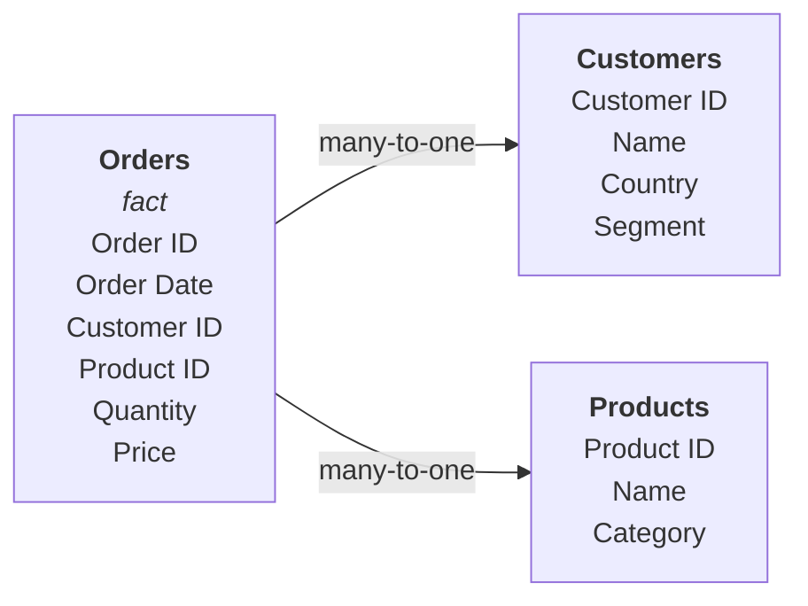

# Sales Model Walkthrough

This example walks through a complete semantic model for a sales analytics use case with customers, products, and orders.

## The Model

```yaml
# yaml-language-server: $schema=schema/obml-schema.json
version: 1.0

dataObjects:
  Customers:
    code: CUSTOMERS
    database: WAREHOUSE
    schema: PUBLIC
    columns:
      Customer ID:
        code: CUSTOMER_ID
        abstractType: string
      Customer Name:
        code: NAME
        abstractType: string
      Country:
        code: COUNTRY
        abstractType: string
      Segment:
        code: SEGMENT
        abstractType: string

  Products:
    code: PRODUCTS
    database: WAREHOUSE
    schema: PUBLIC
    columns:
      Product ID:
        code: PRODUCT_ID
        abstractType: string
      Product Name:
        code: NAME
        abstractType: string
      Category:
        code: CATEGORY
        abstractType: string

  Orders:
    code: ORDERS
    database: WAREHOUSE
    schema: PUBLIC
    columns:
      Order ID:
        code: ORDER_ID
        abstractType: string
      Order Date:
        code: ORDER_DATE
        abstractType: date
      Customer ID:
        code: CUSTOMER_ID
        abstractType: string
      Product ID:
        code: PRODUCT_ID
        abstractType: string
      Quantity:
        code: QUANTITY
        abstractType: int
      Price:
        code: PRICE
        abstractType: float
    joins:
      - joinType: many-to-one
        joinTo: Customers
        columnsFrom:
          - Customer ID
        columnsTo:
          - Customer ID
      - joinType: many-to-one
        joinTo: Products
        columnsFrom:
          - Product ID
        columnsTo:
          - Product ID

dimensions:
  Customer Country:
    dataObject: Customers
    column: Country
    resultType: string

  Customer Segment:
    dataObject: Customers
    column: Segment
    resultType: string

  Product Name:
    dataObject: Products
    column: Product Name
    resultType: string

  Product Category:
    dataObject: Products
    column: Category
    resultType: string

  Order Date:
    dataObject: Orders
    column: Order Date
    resultType: date
    timeGrain: month

measures:
  Revenue:
    resultType: float
    aggregation: sum
    expression: '{[Price]} * {[Quantity]}'

  Order Count:
    columns:
      - dataObject: Orders
        column: Order ID
    resultType: int
    aggregation: count

  Average Order Value:
    resultType: float
    aggregation: avg
    expression: '{[Price]} * {[Quantity]}'

metrics:
  Revenue per Order:
    expression: '{[Revenue]} / {[Order Count]}'
```

## Data Objects Explained

### Star Schema Structure

This model follows a classic star schema:



**Orders** is the fact table — it declares joins to both dimension tables. The compiler automatically identifies it as the base object because it has join definitions.

### Column Mapping

Each column maps a business name to a physical column:

| Data Object | Business Name | Physical Column |
|-------------|--------------|-----------------|
| Customers | Customer ID | `CUSTOMER_ID` |
| Customers | Country | `COUNTRY` |
| Products | Product Name | `NAME` |
| Orders | Price | `PRICE` |

The physical column name appears in generated SQL, while the business name is used in dimensions, measures, and queries.

## Dimensions Explained

### Standard Dimension

```yaml
Customer Country:
  dataObject: Customers
  column: Country
  resultType: string
```

References the `Country` column in the `Customers` data object. When queried, generates `"Customers"."COUNTRY"` with a GROUP BY.

### Time Dimension

```yaml
Order Date:
  dataObject: Orders
  column: Order Date
  resultType: date
  timeGrain: month
```

The `timeGrain: month` means queries using this dimension will apply `date_trunc('month', ...)` by default.

## Measures Explained

### Expression Measure — Revenue

```yaml
Revenue:
  resultType: float
  aggregation: sum
  expression: '{[Price]} * {[Quantity]}'
```

Compiles to: `SUM("Orders"."PRICE" * "Orders"."QUANTITY")`

The expression references columns using `{[Column]}` syntax. The `sum` aggregation wraps the entire expression.

### Simple Measure — Order Count

```yaml
Order Count:
  columns:
    - dataObject: Orders
      column: Order ID
  resultType: int
  aggregation: count
```

Compiles to: `COUNT("Orders"."ORDER_ID")`

### Expression Measure — Average Order Value

```yaml
Average Order Value:
  resultType: float
  aggregation: avg
  expression: '{[Price]} * {[Quantity]}'
```

Compiles to: `AVG("Orders"."PRICE" * "Orders"."QUANTITY")`

Uses `{[Column]}` syntax to reference columns directly in the expression — no `columns` array needed.

## Metrics Explained

```yaml
Revenue per Order:
  expression: '{[Revenue]} / {[Order Count]}'
```

This divides Revenue by Order Count. The `{[Revenue]}` and `{[Order Count]}` placeholders reference the measures defined above by name. Each measure is computed independently and then combined in the metric expression.

## Example Queries

### Revenue by Country

```python
query = QueryObject(
    select=QuerySelect(
        dimensions=["Customer Country"],
        measures=["Revenue", "Order Count"],
    ),
    order_by=[QueryOrderBy(field="Revenue", direction=SortDirection.DESC)],
    limit=1000,
)
```

**Generated SQL (Postgres):**

```sql
SELECT
  "Customers"."COUNTRY" AS "Customer Country",
  SUM("Orders"."PRICE" * "Orders"."QUANTITY") AS "Revenue",
  COUNT("Orders"."ORDER_ID") AS "Order Count"
FROM WAREHOUSE.PUBLIC.ORDERS AS "Orders"
LEFT JOIN WAREHOUSE.PUBLIC.CUSTOMERS AS "Customers"
  ON "Orders"."CUSTOMER_ID" = "Customers"."CUSTOMER_ID"
GROUP BY "Customers"."COUNTRY"
ORDER BY "Revenue" DESC
LIMIT 1000
```

### Filtered Query — SMB Customers

```python
query = QueryObject(
    select=QuerySelect(
        dimensions=["Customer Country"],
        measures=["Revenue"],
    ),
    where=[
        QueryFilter(field="Customer Segment", op=FilterOperator.IN, value=["SMB", "MidMarket"]),
    ],
)
```

**Generated SQL:**

```sql
SELECT
  "Customers"."COUNTRY" AS "Customer Country",
  SUM("Orders"."PRICE" * "Orders"."QUANTITY") AS "Revenue"
FROM WAREHOUSE.PUBLIC.ORDERS AS "Orders"
LEFT JOIN WAREHOUSE.PUBLIC.CUSTOMERS AS "Customers"
  ON "Orders"."CUSTOMER_ID" = "Customers"."CUSTOMER_ID"
WHERE ("Customers"."SEGMENT" IN ('SMB', 'MidMarket'))
GROUP BY "Customers"."COUNTRY"
```

### Multi-Dimension Query

```python
query = QueryObject(
    select=QuerySelect(
        dimensions=["Customer Country", "Product Category"],
        measures=["Revenue"],
    ),
)
```

**Generated SQL:**

```sql
SELECT
  "Customers"."COUNTRY" AS "Customer Country",
  "Products"."CATEGORY" AS "Product Category",
  SUM("Orders"."PRICE" * "Orders"."QUANTITY") AS "Revenue"
FROM WAREHOUSE.PUBLIC.ORDERS AS "Orders"
LEFT JOIN WAREHOUSE.PUBLIC.CUSTOMERS AS "Customers"
  ON "Orders"."CUSTOMER_ID" = "Customers"."CUSTOMER_ID"
LEFT JOIN WAREHOUSE.PUBLIC.PRODUCTS AS "Products"
  ON "Orders"."PRODUCT_ID" = "Products"."PRODUCT_ID"
GROUP BY "Customers"."COUNTRY", "Products"."CATEGORY"
```

Notice how the compiler automatically adds the `Products` join because the `Product Category` dimension requires it.
