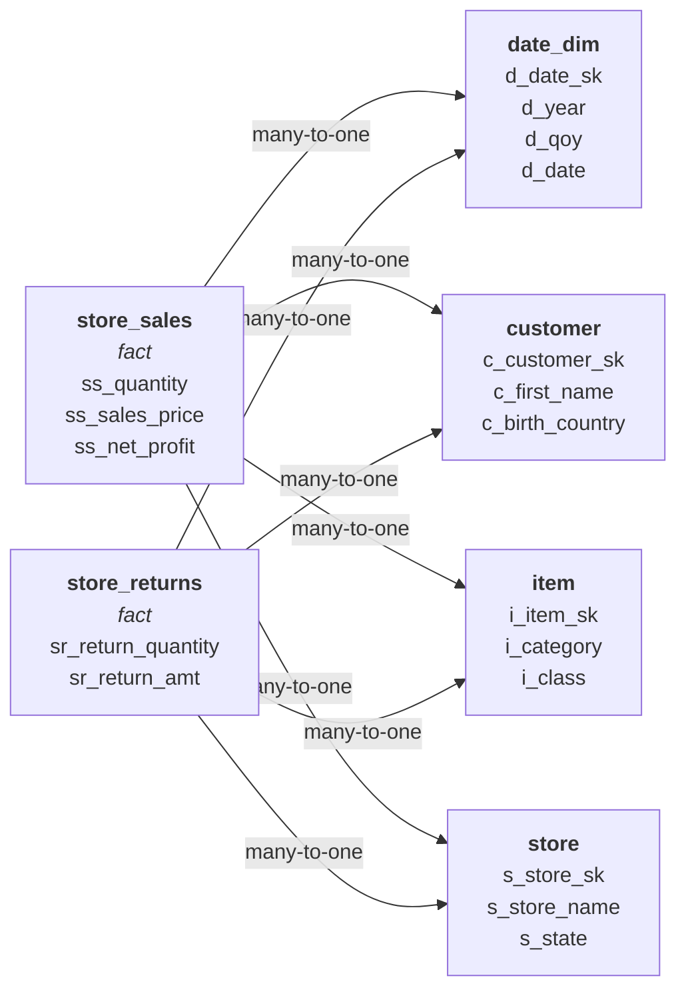

# TPC-DS Benchmark

This example shows how to model a subset of the [TPC-DS](https://www.tpc.org/tpcds/) benchmark — an industry-standard decision support benchmark — using OrionBelt's OBML format.

TPC-DS models a retail company with multiple sales channels (store, catalog, web), returns, inventory, and a rich set of dimension tables. We focus on **store sales** and **store returns** with key dimensions to demonstrate both star schema and CFL planning.

## The Model

```yaml
# yaml-language-server: $schema=schema/obml-schema.json
version: 1.0

dataObjects:
  store_sales:
    code: STORE_SALES
    database: TPCDS
    schema: PUBLIC
    columns:
      ss_sold_date_sk:
        code: SS_SOLD_DATE_SK
        abstractType: int
      ss_customer_sk:
        code: SS_CUSTOMER_SK
        abstractType: int
      ss_item_sk:
        code: SS_ITEM_SK
        abstractType: int
      ss_store_sk:
        code: SS_STORE_SK
        abstractType: int
      ss_quantity:
        code: SS_QUANTITY
        abstractType: int
      ss_sales_price:
        code: SS_SALES_PRICE
        abstractType: float
      ss_net_profit:
        code: SS_NET_PROFIT
        abstractType: float
    joins:
      - joinType: many-to-one
        joinTo: date_dim
        columnsFrom:
          - ss_sold_date_sk
        columnsTo:
          - d_date_sk
      - joinType: many-to-one
        joinTo: customer
        columnsFrom:
          - ss_customer_sk
        columnsTo:
          - c_customer_sk
      - joinType: many-to-one
        joinTo: item
        columnsFrom:
          - ss_item_sk
        columnsTo:
          - i_item_sk
      - joinType: many-to-one
        joinTo: store
        columnsFrom:
          - ss_store_sk
        columnsTo:
          - s_store_sk

  store_returns:
    code: STORE_RETURNS
    database: TPCDS
    schema: PUBLIC
    columns:
      sr_returned_date_sk:
        code: SR_RETURNED_DATE_SK
        abstractType: int
      sr_customer_sk:
        code: SR_CUSTOMER_SK
        abstractType: int
      sr_item_sk:
        code: SR_ITEM_SK
        abstractType: int
      sr_store_sk:
        code: SR_STORE_SK
        abstractType: int
      sr_return_quantity:
        code: SR_RETURN_QUANTITY
        abstractType: int
      sr_return_amt:
        code: SR_RETURN_AMT
        abstractType: float
    joins:
      - joinType: many-to-one
        joinTo: date_dim
        columnsFrom:
          - sr_returned_date_sk
        columnsTo:
          - d_date_sk
      - joinType: many-to-one
        joinTo: customer
        columnsFrom:
          - sr_customer_sk
        columnsTo:
          - c_customer_sk
      - joinType: many-to-one
        joinTo: item
        columnsFrom:
          - sr_item_sk
        columnsTo:
          - i_item_sk
      - joinType: many-to-one
        joinTo: store
        columnsFrom:
          - sr_store_sk
        columnsTo:
          - s_store_sk

  date_dim:
    code: DATE_DIM
    database: TPCDS
    schema: PUBLIC
    columns:
      d_date_sk:
        code: D_DATE_SK
        abstractType: int
      d_date:
        code: D_DATE
        abstractType: date
      d_year:
        code: D_YEAR
        abstractType: int
      d_qoy:
        code: D_QOY
        abstractType: int

  customer:
    code: CUSTOMER
    database: TPCDS
    schema: PUBLIC
    columns:
      c_customer_sk:
        code: C_CUSTOMER_SK
        abstractType: int
      c_first_name:
        code: C_FIRST_NAME
        abstractType: string
      c_last_name:
        code: C_LAST_NAME
        abstractType: string
      c_birth_country:
        code: C_BIRTH_COUNTRY
        abstractType: string

  item:
    code: ITEM
    database: TPCDS
    schema: PUBLIC
    columns:
      i_item_sk:
        code: I_ITEM_SK
        abstractType: int
      i_item_id:
        code: I_ITEM_ID
        abstractType: string
      i_category:
        code: I_CATEGORY
        abstractType: string
      i_class:
        code: I_CLASS
        abstractType: string

  store:
    code: STORE
    database: TPCDS
    schema: PUBLIC
    columns:
      s_store_sk:
        code: S_STORE_SK
        abstractType: int
      s_store_name:
        code: S_STORE_NAME
        abstractType: string
      s_state:
        code: S_STATE
        abstractType: string

dimensions:
  Year:
    dataObject: date_dim
    column: d_year
    resultType: int

  Quarter:
    dataObject: date_dim
    column: d_qoy
    resultType: int

  Sale Date:
    dataObject: date_dim
    column: d_date
    resultType: date

  Customer Country:
    dataObject: customer
    column: c_birth_country
    resultType: string

  Item Category:
    dataObject: item
    column: i_category
    resultType: string

  Item Class:
    dataObject: item
    column: i_class
    resultType: string

  Store Name:
    dataObject: store
    column: s_store_name
    resultType: string

  Store State:
    dataObject: store
    column: s_state
    resultType: string

measures:
  Sales Amount:
    resultType: float
    aggregation: sum
    expression: '{[store_sales].[ss_sales_price]} * {[store_sales].[ss_quantity]}'

  Net Profit:
    columns:
      - dataObject: store_sales
        column: ss_net_profit
    resultType: float
    aggregation: sum

  Quantity Sold:
    columns:
      - dataObject: store_sales
        column: ss_quantity
    resultType: int
    aggregation: sum

  Return Amount:
    columns:
      - dataObject: store_returns
        column: sr_return_amt
    resultType: float
    aggregation: sum

  Quantity Returned:
    columns:
      - dataObject: store_returns
        column: sr_return_quantity
    resultType: int
    aggregation: sum

metrics:
  Return Rate:
    expression: '{[Quantity Returned]} / {[Quantity Sold]}'

  Net Revenue:
    expression: '{[Sales Amount]} - {[Return Amount]}'
```

### Schema Diagram



Both `store_sales` and `store_returns` share the same four dimension tables — classic conformed dimensions in TPC-DS.

## Query 1: Sales by Year and Item Category (Star Schema)

A single-fact query using only `store_sales` measures:

```python
query = QueryObject(
    select=QuerySelect(
        dimensions=["Year", "Item Category"],
        measures=["Sales Amount", "Net Profit"],
    ),
    order_by=[QueryOrderBy(field="Sales Amount", direction=SortDirection.DESC)],
    limit=1000,
)
```

**Generated SQL (Postgres):**

```sql
SELECT
  "date_dim"."D_YEAR" AS "Year",
  "item"."I_CATEGORY" AS "Item Category",
  SUM("store_sales"."SS_SALES_PRICE" * "store_sales"."SS_QUANTITY") AS "Sales Amount",
  SUM("store_sales"."SS_NET_PROFIT") AS "Net Profit"
FROM TPCDS.PUBLIC.STORE_SALES AS "store_sales"
LEFT JOIN TPCDS.PUBLIC.DATE_DIM AS "date_dim"
  ON "store_sales"."SS_SOLD_DATE_SK" = "date_dim"."D_DATE_SK"
LEFT JOIN TPCDS.PUBLIC.ITEM AS "item"
  ON "store_sales"."SS_ITEM_SK" = "item"."I_ITEM_SK"
GROUP BY "date_dim"."D_YEAR", "item"."I_CATEGORY"
ORDER BY "Sales Amount" DESC
LIMIT 1000
```

All measures come from `store_sales`, so the star schema planner handles this with a simple SELECT + JOINs.

## Query 2: Sales vs Returns by Customer Country (CFL)

When we combine measures from both `store_sales` and `store_returns`, the CFL planner kicks in:

```python
query = QueryObject(
    select=QuerySelect(
        dimensions=["Customer Country"],
        measures=["Sales Amount", "Return Amount"],
    ),
    order_by=[QueryOrderBy(field="Sales Amount", direction=SortDirection.DESC)],
)
```

**Generated SQL (Postgres):**

```sql
WITH composite_01 AS (
  SELECT
    "customer"."C_BIRTH_COUNTRY" AS "Customer Country",
    "store_sales"."SS_SALES_PRICE" * "store_sales"."SS_QUANTITY" AS "Sales Amount",
    NULL AS "Return Amount"
  FROM TPCDS.PUBLIC.STORE_SALES AS "store_sales"
  LEFT JOIN TPCDS.PUBLIC.CUSTOMER AS "customer"
    ON "store_sales"."SS_CUSTOMER_SK" = "customer"."C_CUSTOMER_SK"

  UNION ALL

  SELECT
    "customer"."C_BIRTH_COUNTRY" AS "Customer Country",
    NULL AS "Sales Amount",
    "store_returns"."SR_RETURN_AMT" AS "Return Amount"
  FROM TPCDS.PUBLIC.STORE_RETURNS AS "store_returns"
  LEFT JOIN TPCDS.PUBLIC.CUSTOMER AS "customer"
    ON "store_returns"."SR_CUSTOMER_SK" = "customer"."C_CUSTOMER_SK"
)
SELECT
  "Customer Country",
  SUM("Sales Amount") AS "Sales Amount",
  SUM("Return Amount") AS "Return Amount"
FROM composite_01
GROUP BY "Customer Country"
ORDER BY "Sales Amount" DESC
```

The two fact legs are stacked with `UNION ALL` — each leg selects the conformed dimension plus its own measure, with `NULL` for the other fact's measure. The outer query aggregates over the union, and `SUM` naturally ignores the NULLs.

## Query 3: Quarterly Net Profit with Time Grain

Using a time grain on the `Sale Date` dimension:

```python
query = QueryObject(
    select=QuerySelect(
        dimensions=["Sale Date:quarter"],
        measures=["Net Profit"],
    ),
    order_by=[QueryOrderBy(field="Sale Date", direction=SortDirection.ASC)],
)
```

### Multi-Dialect Output

=== "PostgreSQL"

    ```sql
    SELECT
      date_trunc('quarter', "date_dim"."D_DATE") AS "Sale Date",
      SUM("store_sales"."SS_NET_PROFIT") AS "Net Profit"
    FROM TPCDS.PUBLIC.STORE_SALES AS "store_sales"
    LEFT JOIN TPCDS.PUBLIC.DATE_DIM AS "date_dim"
      ON "store_sales"."SS_SOLD_DATE_SK" = "date_dim"."D_DATE_SK"
    GROUP BY date_trunc('quarter', "date_dim"."D_DATE")
    ORDER BY "Sale Date" ASC
    ```

    **Key traits:** `date_trunc('quarter', ...)` for time grain truncation.

=== "Snowflake"

    ```sql
    SELECT
      DATE_TRUNC('quarter', "date_dim"."D_DATE") AS "Sale Date",
      SUM("store_sales"."SS_NET_PROFIT") AS "Net Profit"
    FROM TPCDS.PUBLIC.STORE_SALES AS "store_sales"
    LEFT JOIN TPCDS.PUBLIC.DATE_DIM AS "date_dim"
      ON "store_sales"."SS_SOLD_DATE_SK" = "date_dim"."D_DATE_SK"
    GROUP BY DATE_TRUNC('quarter', "date_dim"."D_DATE")
    ORDER BY "Sale Date" ASC
    ```

    **Key traits:** `DATE_TRUNC()` in uppercase, double-quoted identifiers.

=== "ClickHouse"

    ```sql
    SELECT
      toStartOfQuarter("date_dim"."D_DATE") AS "Sale Date",
      SUM("store_sales"."SS_NET_PROFIT") AS "Net Profit"
    FROM TPCDS.PUBLIC.STORE_SALES AS "store_sales"
    LEFT JOIN TPCDS.PUBLIC.DATE_DIM AS "date_dim"
      ON "store_sales"."SS_SOLD_DATE_SK" = "date_dim"."D_DATE_SK"
    GROUP BY toStartOfQuarter("date_dim"."D_DATE")
    ORDER BY "Sale Date" ASC
    ```

    **Key traits:** ClickHouse uses native `toStartOfQuarter()` instead of `date_trunc`.

=== "Dremio"

    ```sql
    SELECT
      DATE_TRUNC('quarter', "date_dim"."D_DATE") AS "Sale Date",
      SUM("store_sales"."SS_NET_PROFIT") AS "Net Profit"
    FROM TPCDS.PUBLIC.STORE_SALES AS "store_sales"
    LEFT JOIN TPCDS.PUBLIC.DATE_DIM AS "date_dim"
      ON "store_sales"."SS_SOLD_DATE_SK" = "date_dim"."D_DATE_SK"
    GROUP BY DATE_TRUNC('quarter', "date_dim"."D_DATE")
    ORDER BY "Sale Date" ASC
    ```

    **Key traits:** `DATE_TRUNC()` uppercase, same quoting as Postgres/Snowflake.

=== "Databricks"

    ```sql
    SELECT
      date_trunc('quarter', `date_dim`.`D_DATE`) AS `Sale Date`,
      SUM(`store_sales`.`SS_NET_PROFIT`) AS `Net Profit`
    FROM TPCDS.PUBLIC.STORE_SALES AS `store_sales`
    LEFT JOIN TPCDS.PUBLIC.DATE_DIM AS `date_dim`
      ON `store_sales`.`SS_SOLD_DATE_SK` = `date_dim`.`D_DATE_SK`
    GROUP BY date_trunc('quarter', `date_dim`.`D_DATE`)
    ORDER BY `Sale Date` ASC
    ```

    **Key traits:** Backtick-quoted identifiers (Spark SQL), lowercase `date_trunc`.

## Query 4: Return Rate Metric (CFL)

The `Return Rate` metric combines measures from both fact tables:

```python
query = QueryObject(
    select=QuerySelect(
        dimensions=["Year", "Store State"],
        measures=["Return Rate"],
    ),
)
```

**Generated SQL (Postgres):**

```sql
WITH composite_01 AS (
  SELECT
    "date_dim"."D_YEAR" AS "Year",
    "store"."S_STATE" AS "Store State",
    "store_returns"."SR_RETURN_QUANTITY" AS "Quantity Returned",
    NULL AS "Quantity Sold"
  FROM TPCDS.PUBLIC.STORE_RETURNS AS "store_returns"
  LEFT JOIN TPCDS.PUBLIC.DATE_DIM AS "date_dim"
    ON "store_returns"."SR_RETURNED_DATE_SK" = "date_dim"."D_DATE_SK"
  LEFT JOIN TPCDS.PUBLIC.STORE AS "store"
    ON "store_returns"."SR_STORE_SK" = "store"."S_STORE_SK"

  UNION ALL

  SELECT
    "date_dim"."D_YEAR" AS "Year",
    "store"."S_STATE" AS "Store State",
    NULL AS "Quantity Returned",
    "store_sales"."SS_QUANTITY" AS "Quantity Sold"
  FROM TPCDS.PUBLIC.STORE_SALES AS "store_sales"
  LEFT JOIN TPCDS.PUBLIC.DATE_DIM AS "date_dim"
    ON "store_sales"."SS_SOLD_DATE_SK" = "date_dim"."D_DATE_SK"
  LEFT JOIN TPCDS.PUBLIC.STORE AS "store"
    ON "store_sales"."SS_STORE_SK" = "store"."S_STORE_SK"
)
SELECT
  "Year",
  "Store State",
  (SUM("Quantity Returned") / SUM("Quantity Sold")) AS "Return Rate"
FROM composite_01
GROUP BY "Year", "Store State"
```

The metric expression `{[Quantity Returned]} / {[Quantity Sold]}` is applied to the aggregated sums in the outer SELECT.

## Compiling for All Dialects

```python
from orionbelt.compiler.pipeline import CompilationPipeline

pipeline = CompilationPipeline()

for dialect in ["postgres", "snowflake", "clickhouse", "dremio", "databricks"]:
    result = pipeline.compile(query, model, dialect)
    print(f"--- {dialect} ---")
    print(result.sql)
    print()
```
